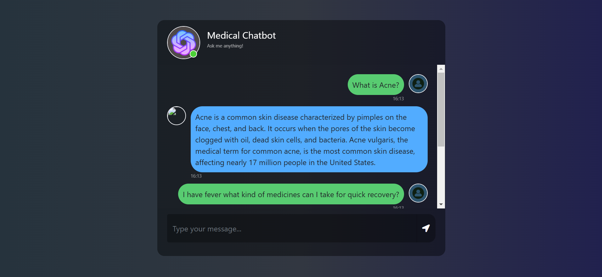

# Gen AI Medical Chatbot

A question-answering system built with LangChain, Pinecone, and Groq that retrieves medical information from the Gale Encyclopedia of Medicine and other PDF documents.

## Features

- PDF document loading and processing
- Chunking of medical texts for efficient retrieval
- Vector embeddings using Hugging Face's sentence transformers
- Vector storage and similarity search via Pinecone
- Natural language question answering with Groq's Mixtral model
- RESTful API interface via Flask

## Installation

1. Clone the repository:
   ```
   git clone https://github.com/ArunArumugamD/Gen-AI-Medical-Chatbot.git
   cd Gen-AI-Medical-Chatbot
   ```

2. Create and activate a virtual environment:
   ```
   conda create -n medibot python=3.10
   conda activate medibot
   ```

3. Install dependencies:
   ```
   pip install -r requirements.txt
   ```

4. Create a `.env` file with your API keys:
   ```
   PINECONE_API_KEY=your_pinecone_api_key
   GROQ_API_KEY=your_groq_api_key
   ```

## Usage

### 1. Index Your Medical Documents

Place your medical PDF files in the `data/` directory and run:
```
python store_index.py
```

This will:
- Load all PDFs from the data directory
- Split text into manageable chunks (500 characters with 20 character overlap)
- Generate embeddings using all-MiniLM-L6-v2 model
- Create a Pinecone index and store the embeddings

### 2. Run the Application

```
python app.py
```

### 3. Query Medical Information

```
# Using the web interface
Open your browser to http://localhost:8080

# Or make API requests to the endpoint
POST http://localhost:8080/get
Form data: msg=your medical question here
```

The system will retrieve relevant information from the Gale Encyclopedia of Medicine and other medical documents, providing concise, three-sentence answers to your questions.

## Project Structure

- `data/` - Directory for storing medical PDFs
- `src/` - Core functionality modules
  - `helper.py` - Utility functions for document processing
  - `prompt.py` - System prompts for the LLM
- `store_index.py` - Script to create and populate the vector index
- `app.py` - Flask web application with chat interface
  - Serves a web UI at http://localhost:8080
  - Provides a `/get` endpoint for question-answering
- `research/trials.ipynb` - Jupyter notebook for experimentation

## Technical Details

- Knowledge base: Gale Encyclopedia of Medicine
- Embedding dimension: 384
- Chunk size: 500 characters
- Vector similarity metric: Cosine
- LLM: Mixtral 8x7B (32K context)
- Temperature: 0.4 (balanced creativity and accuracy)
- Retrieval: Top 3 most similar chunks (k=3)


ScreenShots:


